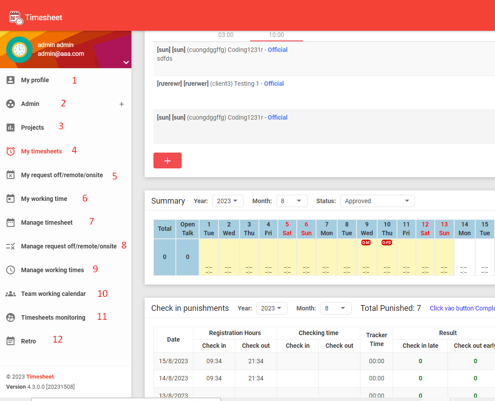
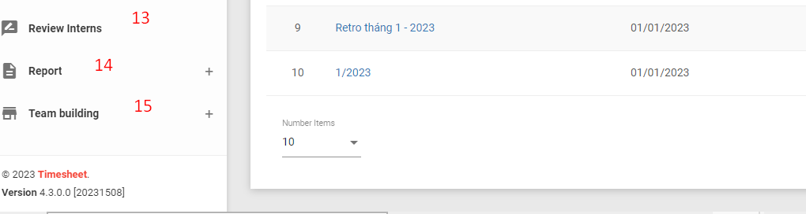
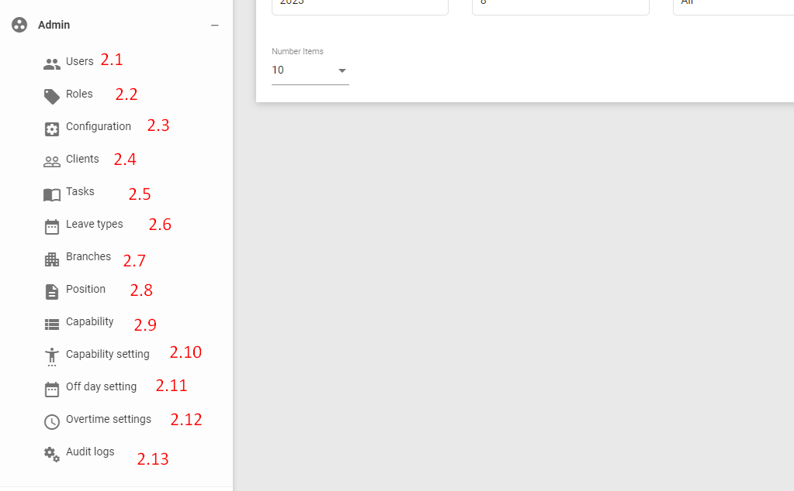
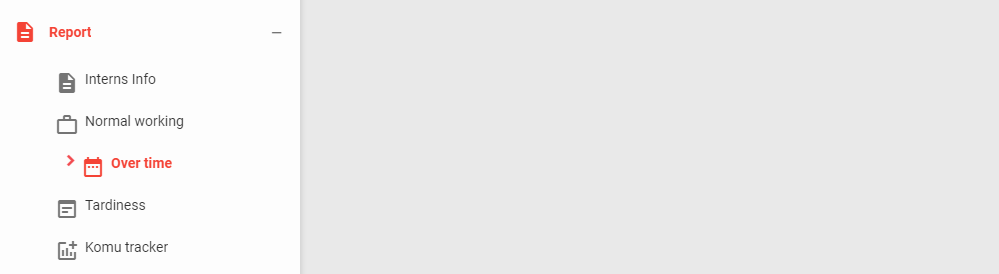
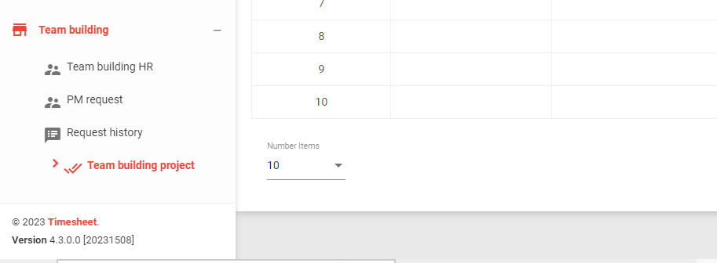
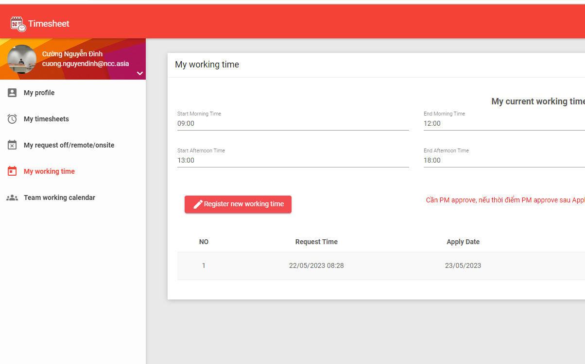

# TimeSheet


## Overview

TimeSheet is an open-source application that  a versatile application utilized by both companies and employees for efficient time management, encompassing various functionalities such as work hours tracking and request submissions for time off. It seamlessly integrates with other internal applications, acting as a hub that connects tools like the check-in/out app and the komu app. This integration facilitates the seamless dissemination of notifications to employees within the company. Additionally, it collaborates with trackers to accurately monitor and record employees' working hours, ensuring comprehensive timekeeping 
## Table of Contents

- [TimeSheet](#timesheet)
  - [Overview](#overview)
  - [Table of Contents](#table-of-contents)
  - [Getting Started](#getting-started)
    - [Prerequisites](#prerequisites)
    - [Clone project](#clone-project)
    - [Backend Setup](#backend-setup)
    - [Frontend Setup](#frontend-setup)
    - [Building](#building)
    - [Running](#running)
- [Screenshot Tutorial](#screenshot-tutorial)
  - [Admin page](#admin-page)
  - [Basic user page](#basic-user-page)

## Getting Started

### Prerequisites

Before you begin, ensure you have met the following requirements:

- [Visual Studio 2022](https://visualstudio.microsoft.com/) installed.
- [.NET Core 2.1 SDK](https://dotnet.microsoft.com/en-us/download/dotnet/2.1) installed.
- [ASP.NET Runtime 2.0.9](https://dotnet.microsoft.com/en-us/download/dotnet/2.0) installed.
- [Visual Studio Code](https://code.visualstudio.com/) installed.
- [Node.js 14.20](https://nodejs.org/en/blog/release/v14.20.0) and npm (Node.js Package Manager) installed.
- [SQL Server](https://www.microsoft.com/en-in/sql-server/sql-server-downloads) installed.

### Clone project
1. **Create a folder** to store the backend and frontend code.
- example:  folder `timesheet`

2. **Open a command prompt** in the created folder.

3. **Clone the backend repository** using the following command:

   ```bash
   git clone https://github.com/ncc-erp/ncc-erp-timesheet.git
   ```

### Backend Setup
1. Open the backend solution using **Visual Studio 2022**:

- Launch `Visual Studio 2022`.
- Select `File` > `Open` > `Project/Solution.`
- Navigate to the backend folder within created folder `timesheet` and open the solution file.
2. Restore NuGet packages:

- In Solution Explorer, right-click the solution and select **Restore NuGet Packages**.
3. **Set the startup project:**

- Navigate to the path `aspnet-core/src/TimeSheet.Web.Host` then right-click `TimeSheet.Web.Host`  in `Solution Explorer`.
Select **Set as StartUp Project**.
4. Update the `appsettings.json` file:

- Open the `appsettings.json` file in the backend project.

- Locate the `ConnectionStrings` section.

- Update the **Default** connection string to match your local database information:

```json
{
  "ConnectionStrings": {
    "Default": "Server=servername; Database=local-timesheet; User ID=yourUserId;Password=yourPassword;"
  },
  // ... other settings ...
}
```

5. Generate your own local database :

- Go to the path ` Tools` > ` NuGet Package Manager`> `Package Manager Console`
- Change `Default project` with `src/TimeSheet.Web.Host`
- Run terminal
```bash
Update-database
```
- **Open sql server, you can see new created database.**


6. 
   -  Press `F5` or select `Debug` > `Start Debugging` to run the backend.
   -  Press `Ctrl + f5` or select `Debug` > `Start without Debugging` to run the backend without debug
**Default port backend**:  `http://localhost:21023/`
 
### Frontend Setup
1. Open Front-end repository
- Select `timesheet` folder > `ncc-erp-timesheet` > `angular`
- open code
```bash
code .
```

2. Install Angular CLI 7.1.3 globally:

```bash

npm install -g @angular/cli@7.1.3

```
3. Install frontend dependencies:
```bash
npm install
```
4. Run front-end
```bash
npm start
```
### Building
To build the project, follow these steps:

1.Build the backend using `Visual Studio Code` or the `command line`.

2.Build the frontend:

```bash
npm run build
```
### Running
To run the project, use these commands:

1. Start the backend using `Visual Studio Code` or the `command line`.

2. Start the frontend:

```bash
npm start
```

# Screenshot Tutorial
Check out our screenshot tutorial on how to use TimeSheet:






## Admin page
**Admin page has full features of basic user should have.**
1. `My profile` : Show user profile information.**
2. `Admin` : This page contains various features intended for administrators.
   
4. `Project` : Manage projects within the internal of company
5. `My timsheets`:Add new daily timesheets and submit time worked for a week or a month.
6. `My request off/remote/onsite`:  Manage and view the status of my submitted requests, including pending, approved, or rejected requests.
7. `My working time` :View and register working hours, with the ability to send the registration to a project manager for confirmation.
8. `Manage timesheets` :  Oversee and manage timesheet records.
9. `Manage request off/remote/onsite` :Manage and monitor employee requests, displaying statuses such as pending, approved, or rejected.
10. `Manage working times ` :  Manage and monitor records submitted to project managers, with a default view of pending records.
11. `Team Working calender` : Export team working calendar information to an Excel file.
12. `Timesheets Monitoring`: Provide an overview of the company's timesheets.
13. `Retro`: Provides a platform for reflection and evaluation based on the recent working period.(a month,1 quater of year,...)
14. `Review intern`: View and create reports for intern performance review.
15. `Report`: 

Generate and manage various reports, including features shown in the provided image.


16. `Team building`: Organize and manage team-building activities.

## Basic user page

1. `My profile` : Show user profile information
2. `My timsheets`:Add new daily timesheets and submit time worked for a week or a month.
3. `My request off/remote/onsite`:  Manage and view the status of my submitted requests, including pending, 
4. `My working time` :View and register working hours, with the ability to send the registration to a project manager for confirmation.
5. `Team Working calender` : view team working calender.